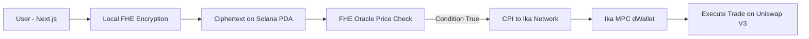

# 🏆 BlindVault

### Zero-Information Omnichain Trading

> Bridgeless liquidity meets absolute zero-knowledge privacy


---

## 🚀 Overview

BlindVault is a privacy-preserving, cross-chain trading vault built for the Ranger "Build-A-Bear" Hackathon.

It enables users to:

* Hide their trading strategies completely
* Execute trades across chains without bridges
* Avoid MEV, front-running, and copy trading

This is achieved using:

* **Fully Homomorphic Encryption (FHE)** on Solana
* **Multi-Party Computation (MPC)** via Ika Network on Ethereum

---

## 🎥 Demo

* 🎥 **Demo & Pitch Video:** [Watch on Youtube](https://youtu.be/0cDasaE2718)

---

## ⚠️ Problem

In DeFi, everything is public.

When a user places a limit order or defines a vault strategy:

* Target prices are visible on-chain
* Bots monitor and exploit these strategies
* Users get front-run or copied

Result:

* Worse execution
* Lost profits
* No privacy

---

## 💡 Solution

BlindVault ensures **zero information leakage**.

### 🔐 Private Strategy Execution (FHE)

* Users encrypt trading conditions in the browser
* Data is stored as ciphertext on Solana
* Smart contracts evaluate conditions without decryption
* No one can see the strategy

### 🌉 Bridgeless Cross-Chain Execution (MPC)

* When conditions are met, execution is triggered
* No bridges or wrapped tokens
* Ika MPC network controls an Ethereum dWallet
* Trade executes directly on Uniswap

---

## 🧠 Architecture



---

## 🔄 Flow Summary

1. User inputs trade conditions
2. Conditions are encrypted locally
3. Encrypted data stored on Solana
4. Oracle prices checked via FHE
5. If condition is true
6. Ika MPC executes trade on Ethereum
7. Trade settles using native assets

---

## 🏗️ Tech Stack

| Layer           | Technology            |
| --------------- | --------------------- |
| Frontend        | Next.js, Tailwind CSS |
| Wallet          | Solana Wallet Adapter |
| Smart Contracts | Rust, Anchor          |
| Privacy         | Encrypt FHE SDK       |
| Cross-Chain     | Ika MPC (dWallets)    |
| Execution       | Uniswap V3            |

---

## ✨ Key Features

* 🔒 Fully private trading strategies
* ⚡ No bridges, no wrapped assets
* 🛡 Protection against MEV and front-running
* 🌐 True cross-chain execution
* 💸 Low fees on Solana, settlement on Ethereum

---

## 🧪 Example Use Case

> A trader wants to buy ETH at $2,000 without revealing it

* They encrypt the target price locally
* The contract monitors price privately
* When ETH hits $2,000
* Trade executes instantly on Ethereum
* No one ever sees the strategy

---

## 🏆 Why This Wins

* Combines **FHE + MPC** into a real product
* Solves a real multi-million dollar problem
* Clean UX with powerful backend
* Fully aligned with hackathon goals

---

## 💻 Run Locally

### 1. Clone Repo

```bash
git clone https://github.com/stnyein/blind-omnichain-vault.git
cd blind-omnichain-vault
```

### 2. Frontend

```bash
cd frontend
npm install
npm run dev
```

### 3. Smart Contracts

```bash
# Build FHE program
cargo build --manifest-path encrypt-pre-alpha/chains/solana/examples/voting/anchor/Cargo.toml
```

---

## 📦 Project Structure

```bash
blind-omnichain-vault/
├── frontend/           # Next.js app
├── ika/                # MPC integration
├── encrypt-pre-alpha/  # FHE implementation & Solana programs
└── README.md
```

---

## 🔮 Future Work

* Add more DEX integrations
* Support multiple strategies per vault
* Improve UI/UX for non-technical users
* Add analytics dashboard

---

## 🤝 Team

Built to pioneer **Bridgeless Capital Markets** (via Ika) and **Encrypted Capital Markets** (via Encrypt) on Solana.

---

## ❤️ Acknowledgements

* Solana
* Encrypt Network
* Ika Network
* Uniswap

---

## 📜 License

MIT License
